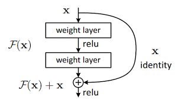
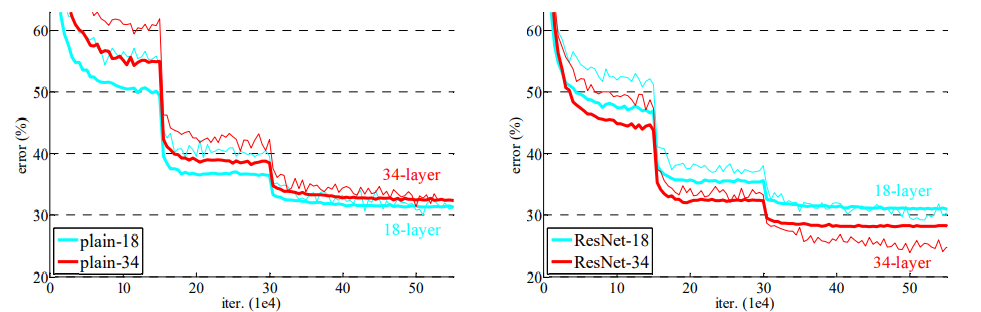
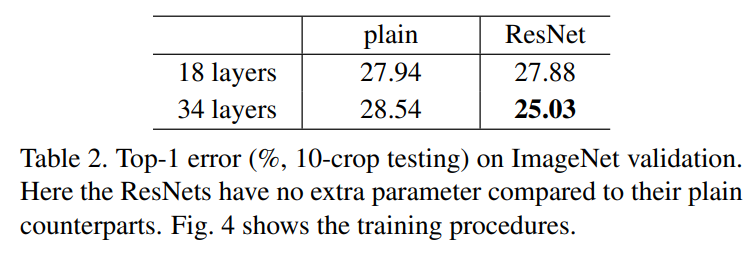

# Resnet

## Benefits
Deeper neural networks are more difficult to train. We
present a residual learning framework to ease the training
of networks that are substantially deeper than those used
previously meanwhile easier to optimized and The depth of representations is of central importance for many visual recognition tasks.

## : Is learning better networks as easy as stacking more layers?
An obstacle to answering this question was the notorious
problem of vanishing/exploding gradients  This problem,
however, has been largely addressed by normalized initialization and intermediate normalization layers , which enable networks with tens of layers to start converging for stochastic gradient descent but after some point when the network depth increasing, accuracy gets saturated  and then degrades rapidly.
therefore:
1) Our extremely deep residual nets are easy to optimize
2) Our deep residual nets can easily enjoyaccuracy gains from greatly increased depth

>for more detail see Experiments Section

## Arechichture and Illustration
the resnet consist of Shortcut connections. those skipping one or
more layers. In our case, the shortcut connections simply
perform identity mapping, and their outputs are added to
the outputs of the stacked layers . Identity shortcut connections add neither extra parameter nor computational complexity. The entire network can still be trained
end-to-end by SGD with backpropagation, and can be easily implemented using common libraries (e.g., Caffe)
without modifying the solvers.

*identity mapping* :  identity mapping is a technique used within shortcut connections where the input x is directly passed as the output without any change(sorthcut connection)

Input │ ▼ [Conv 1x1, F] │ ▼ [Conv 3x3, F] │ ▼ [Conv 1x1, 4F] │ ▼ [Skip Connection](add inputto output) ────► (+) ───► ReLU

## Experiments
We present comprehensive experiments on ImageNet
to show the degradation problem and evaluate our
method. We show that: 
1) Our extremely deep residual nets are easy to optimize, but the counterpart “plain” nets (that
simply stack layers) exhibit higher training error when the
depth increases
2) Our deep residual nets can easily enjoy
accuracy gains from greatly increased depth, producing results substantially better than previous networks.

On the ImageNet classification dataset , we obtain
excellent results by extremely deep residual nets. Our 152-
layer residual net is the deepest network ever presented on
ImageNet, while still having lower complexity than VGG
nets
On the ImageNet classification dataset , we obtain
excellent results by extremely deep residual nets. Our 152-
layer residual net is the deepest network ever presented on
ImageNet, while still having lower complexity than VGG
nets . Our ensemble has 3.57% top-5 error on the ImageNet test set, and won the 1st place in the ILSVRC
2015 classification competition. The extremely deep representations also have excellent generalization performance
on other recognition tasks, and lead us to further win the
1st places on: ImageNet detection, ImageNet localization,
COCO detection, and COCO segmentation in ILSVRC &
COCO 2015 competitions. This strong evidence shows that
the residual learning principle is generic

We argue that this optimization difficulty is unlikely to
be caused by vanishing gradients. These plain networks are
trained with BN (Batch Normalization), which ensures forward propagated
signals to have non-zero variances.
We conjecture that the deep plain nets may
have exponentially low convergence rates, which impact the reducing of the training error
. The reason for such optimization difficulties will be studied in the future.

