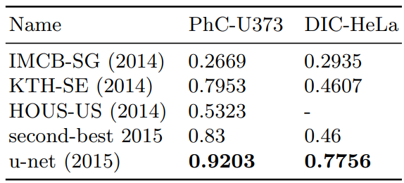

*Code example is [here](U-Net.ipynb)*

this readme is a summery of the U-Net paper

# U-Net
original paper is [here](https://arxiv.org/pdf/1505.04597v1) 

## Architecture

### Architecture in Text format

  
Click me

Contracting Path (Encoder) : [
Input Image ->  
[Conv + ReLU] -> 
[Conv + ReLU] ->
[Max Pooling] ↓  
[Conv + ReLU] ->
[Conv + ReLU] -> 
[Max Pooling] ↓  
(Repeats for more depth...)] ->
Bottleneck : [
[Conv + ReLU] ->
[Conv + ReLU]] 
Expanding Path (Decoder) : [
[Upsampling] ↑  
[Concatenate Skip Connection] -> 
[Conv + ReLU] ->
[Conv + ReLU] ->
[Upsampling] ↑  
[Concatenate Skip Connection] ->  
[Conv + ReLU] ->
[Conv + ReLU] ->
Final Layer: [1x1 Conv + Sigmoid/Softmax] → Output Mask]

## Benefits Told in paper
* present a network and training strategy that relies on the strong
use of data augmentation to use the available annotated samples more
efficiently
* The architecture consists of a contracting path to capture
context and a symmetric expanding path that enables precise localization. 

Bottleneck layer or bottleneck block converts the input data into a compressed form of representation. This compressed representation is the lower dimensional representation of the input data.

## Illustration Network Architecture
It consists of a contracting path (left side) and an expansive path (right side). The contracting path follows the typical architecture of a convolutional network. It consists of the repeated application of two 3x3 convolutions (unpadded convolutions), each followed by a rectified linear unit (ReLU) and a 2x2 max pooling operation with stride 2 for downsampling. At each downsampling step we double the number of feature channels. Every step in the expansive path consists of an upsampling of the feature map followed by a 2x2 convolution (“up-convolution”) that halves the number of feature channels, a concatenation with the correspondingly cropped feature map from the contracting path, and two 3x3 convolutions, each followed by a ReLU. The cropping is necessary due to the loss of border pixels in every convolution. At the final layer a 1x1 convolution is used to map each 64-component feature vector to the desired number of classes. In total the network has 23 convolutional layers. it trained with stochastic gradient descent implementation of Caffe

*the contracting path* :  It consists of repeated application of convolutions, ReLU activations, and max-pooling operation that decrease size of image meanwhile making it deeper in channel.

*the expanding path*: It consists of repeated application of Transposed Convolutions, Concatenation with Corresponding Encoder Features and Convolutional Layer with ReLu activation that decrease the size of image meanwhile totaly  make it shallower in channels.

*bottlenet section* :
Bottleneck layer or bottleneck block converts the input data into a compressed form of representation. This compressed representation is the lower dimensional representation of the input data.
> The ‘bottleneck block’ or ‘bottleneck layers’, capture and learns the abstract feature representation of the input data with lower computational complexity

> First, this network can localize. Secondly, the training data in terms
of patches is much larger than the number of training images that make training quite slow because the network must be run separately for each patch and there are a lot of redundancy due to overlapping patches but Larger patches
require more max-pooling layers that reduce the localization accuracy, small patches allow the network to see only little context

> The network does not have any fully connected layers
and only uses the valid part of each convolution

## Why do we Have some concatinatinng operation?

U-Net processes images in a patch-based manner, meaning that large images are divided into smaller tiles (patches) before being passed through the network(before training).However, convolution and max-pooling layers can cause spatial dimension reductions, especially with unpadded convolutions, which remove border pixels at each layer.
as you can see in the picture To predict the pixels in the border region of the image that will loss due to convolution, the missing context is extrapolated by mirroring the input image(concatinating). *so we need concatinating due to the loss of border pixels in every convolution*.

## Experiments

### Ranking on the EM segmentation challenge (march 6th, 2015), sorted by warping error.

*Pixel Error* :
Pixel Error is the most straightforward among the three metrics being discussed. The number of pixel values that are identical between the ground truth and the predicted is denoted as ‘N’, total number of ground truth pixels is ‘M’, pixel error equals ( M — N / M)

*Warping Error* :
in warping error those discrepancies among the boundary may not worth to be taken too seriously in practical use. Like in the case of segmenting cell images for medical diagnosis, as long as a coarse cell boundary is given, qualitatively the pixel errors near the boundary don’t cause noticeable difference. So warping error is introduced to help.

*Rand Index* :
Rand Index was originally proposed to measure the similarity of two data clusterings, nevertheless, semantic segmentation is to cluster the pixels into integer indexes, so recently, Rand Index(aka RI) and Rand Error(aka RE) are introduced to measure segmentation performance.

### Segmentation results (IOU) on the ISBI cell tracking challenge 2015.

## Dataset
you can download dataset in (here)[https://bbbc.broadinstitute.org/BBBC038]
just download the date and put them in a data folder close to unet python notebook file.