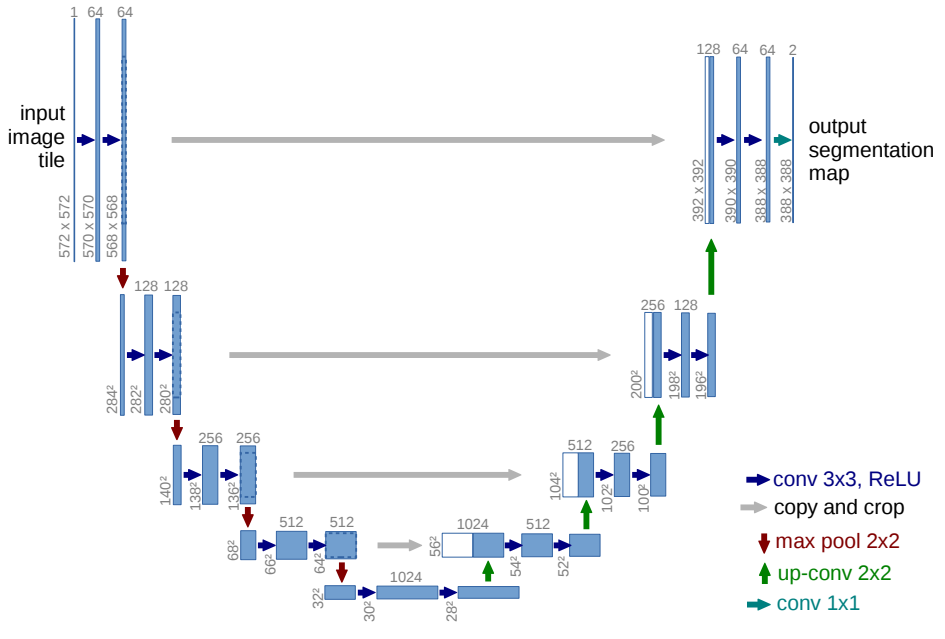
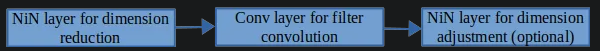

# U-Net
original paper is [here](https://arxiv.org/pdf/1505.04597v1) 

## Architecture

> Architecture in Text format:

  
Click me

Contracting Path (Encoder) : [
Input Image ->  
[Conv + ReLU] -> 
[Conv + ReLU] ->
[Max Pooling] ↓  
[Conv + ReLU] ->
[Conv + ReLU] -> 
[Max Pooling] ↓  
(Repeats for more depth...)] ->
Bottleneck : [
[Conv + ReLU] ->
[Conv + ReLU]] 
Expanding Path (Decoder) : [
[Upsampling] ↑  
[Concatenate Skip Connection] -> 
[Conv + ReLU] ->
[Conv + ReLU] ->
[Upsampling] ↑  
[Concatenate Skip Connection] ->  
[Conv + ReLU] ->
[Conv + ReLU] ->
Final Layer: [1x1 Conv + Sigmoid/Softmax] → Output Mask]

## Benefits Told in paper
* present a network and training strategy that relies on the strong
use of data augmentation to use the available annotated samples more
efficiently
* The architecture consists of a contracting path to capture
context and a symmetric expanding path that enables precise localization. 

Bottleneck layer or bottleneck block converts the input data into a compressed form of representation. This compressed representation is the lower dimensional representation of the input data.

## Illustrate
*the contracting path* :  It consists of repeated application of convolutions, ReLU activations, and max-pooling operation that decrease size of image meanwhile making it deeper in channel.

*the expanding path*: It consists of repeated application of Transposed Convolutions, Concatenation with Corresponding Encoder Features and Convolutional Layer with ReLu activation that decrease the size of image meanwhile totaly  make it shallower in channels.

*bottlenet section* :
Bottleneck layer or bottleneck block converts the input data into a compressed form of representation. This compressed representation is the lower dimensional representation of the input data.
> The ‘bottleneck block’ or ‘bottleneck layers’, capture and learns the abstract feature representation of the input data with lower computational complexity

> First, this network can localize. Secondly, the training data in terms
of patches is much larger than the number of training images that make training quite slow because the network must be run separately for each patch and
there is a lot of redundancy due to overlapping patches but Larger patches
require more max-pooling layers that reduce the localization accuracy, small patches allow the network to see only little context

> The network does not have any fully connected layers
and only uses the valid part of each convolution

